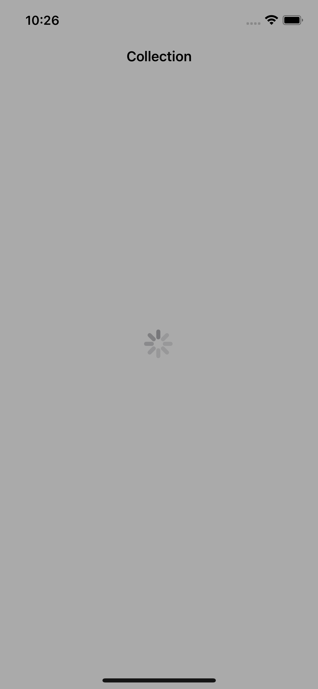
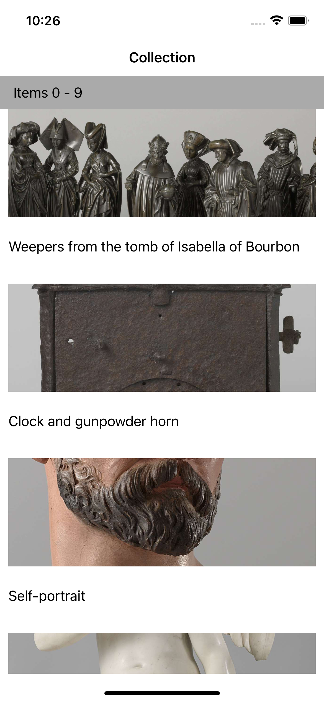
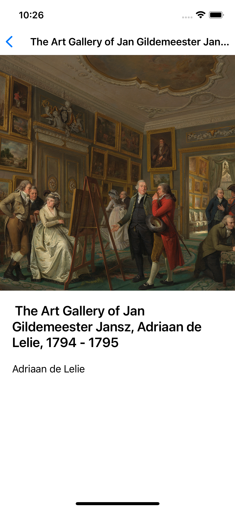

# RijksWonders

Small demo project app for iOS.

## Overview

Displayes data from Rijks Museum (Netherlands). Simple demonstration of essential functionality around fetching JSOn data from abckend via HTTP request and displaying it in UI. Almost completely vanilla iOS SDK, the only 3rd party dependency used is [Kingfisher](https://github.com/onevcat/Kingfisher) for lazy images fetching from URL asyncronously. Follows MVVP and CLEAN Architecture principles with strict separation into layers, where each layer can only depend on 1 layer below: **Services ⬅ Models ⬅ ViewModels ⬅ View (the app itself)**.

